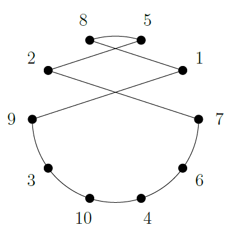
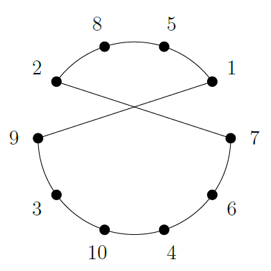
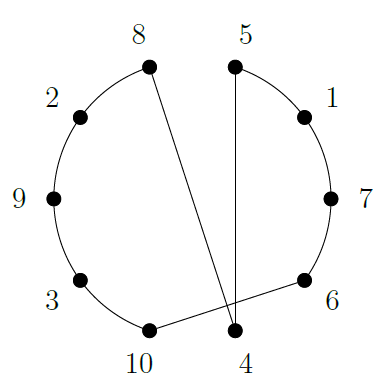
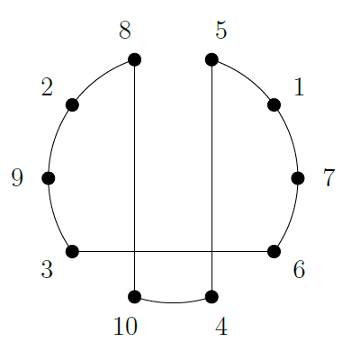
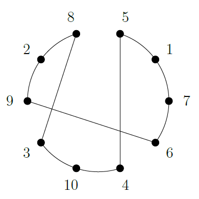

# TSP Solver (Traveling Salesman Problem)

This project implements a solution to the **Traveling Salesman Problem (TSP)** using **C++**. The goal is to find the shortest possible route that visits all cities exactly once and returns to the starting city.

## 💻 About the Project

The project aims to solve the TSP, a classic combinatorial optimization problem. It has applications in various fields such as vehicle routing, circuit planning, logistics, and other areas that involve route optimization.

## 🧠 Algorithm

The implemented algorithm uses swaps between the neighborhood structures to ensures an optimal/sub-optimal solution with the best execution time possible for the chosen method.
The neighborhood structures swaps are described as follows:

- **BestImprovementSwap**: Swaps the position of two vertices in the sequence;
  Taking this into account is crucial for the algorithm's performance.

- **BestImprovement2Opt**: Two non-adjacent edges from the solution are removed, and the segment between them is reinserted in reverse order, adding two new edges to reconstruct the solution.

- **BestImprovementOrOpt (size=1)**: Reinsertion strategy. A single vertex is removed from its position and inserted into another;

- **BestImprovementOrOpt (size=2)**: A block composed of two adjacent vertices is removed from its position and inserted into another;

- **BestImprovementOrOpt (size=3)**: A block composed of three adjacent vertices is removed from its position and inserted into another.

  <p align="center">
    
    <br>Original Structure
  </p>


<div align="center">
  <table>
    <tr>
      <td style="text-align: center;">
        <br/>
        <b>BestImprovementSwap</b>
      </td>
      <td style="text-align: center;">
        <br/>
        <b>BestImprovement2Opt</b>
      </td>
    </tr>
  </table>
  <table>
    <tr>
      <td style="text-align: center;">
        <br/>
        <b>BestImprovementOrOpt (size=1)</b>
      </td>
      <td style="text-align: center;">
        <br/>
        <b>BestImprovementOrOpt (size=2)</b>
      </td>
      <td style="text-align: center;">
        <br/>
        <b>BestImprovementOrOpt (size=3)</b>
      </td>
    </tr>
  </table>
</div>

## 🔧 Prerequisites

To compile and run this project, you will need:

- [GCC](https://gcc.gnu.org/) or any compatible C++ compiler
- [CMake](https://cmake.org/) (optional, to ease the build process)

### Compilation

To compile the project, you can use CMake:
```bash
make
```

## 🚀 How to Use

1. Clone the repository to your local machine:

```bash
git clone https://github.com/your-username/your-repository.git
```

2. Compile the code following the instructions above.
3. Run the program by providing an input file with the distances between cities:

```bash
Format: ./tsp instances/{name_of_instance}.tsp
Ex: ./tsp instances/bays29.tsp
```

Running the program will output something like:

```
Original cost of instances/bays29.tsp: 5752
Solution: 0 27 7 22 26 23 15 18 6 24 10 21 13 16 17 14 3 19 9 12 20 1 2 28 25 4 8 5 11 0
Optmized cost: 2131
Execution Time: 0.0848794 seconds.
```
